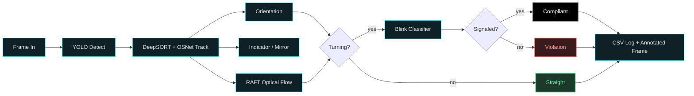

<div align="center">


<br/>

*Real-time detection of motorcycles that turn **without signaling** — built on a custom, five-model computer vision pipeline.*

<br/>

<p>


</p>

<p>


</p>

<a href="https://safe-ride-vision-frontend.vercel.app/"><b>🔗 Live Demo</b></a>
&nbsp;•&nbsp;
<a href="#-getting-started"><b>🚀 Quick Start</b></a>
&nbsp;•&nbsp;
<a href="#-the-pipeline"><b>🧠 Architecture</b></a>

</div>

<br/>

<div align="center">

<br/>
<sub><i>🔴 turning without indicator (violation) · ⚫ turning with indicator on (compliant) · 🟢 going straight</i></sub>
</div>

<br/>

---

## 📌 Overview

**SafeRide Vision** watches road footage, tracks every motorcycle across frames, and flags riders who **turn without signaling**. It fuses five custom-trained models — detection, re-identification, orientation, indicator, and blink classification — into a single DeepSORT-based tracker, then exposes the whole thing behind a Flask + ngrok API that any frontend can drop a video into.

> 💡 **The core problem:** a standard tracker knows *where* a vehicle is. This system also knows *what it's about to do* — and whether it warned anyone first.

<br/>

## 🧠 The Pipeline

<p align="center">
  
</p>

<br/>

## 🔬 Models & Datasets

> Every component here is **custom-trained** — nothing off-the-shelf.

<table width="100%">
<tr>
<th align="left">Component</th>
<th align="left">Architecture</th>
<th align="left">Training Data</th>
<th align="left">Result</th>
</tr>
<tr>
<td>🔦&nbsp;<b>Indicator & Mirror Detector</b></td>
<td>YOLOv12m</td>
<td>~7,000 labeled images<br/>~17,000 instances (<code>indicator</code> + <code>mirror</code>)</td>
<td></td>
</tr>
<tr>
<td>👁️&nbsp;<b>Blink Detector</b></td>
<td>CNN + LSTM<br/><sub>ResNet18 backbone, sequence classifier</sub></td>
<td>1,000 video clips (≤3s)<br/>every 2nd frame labeled — ~30–45 frames/clip</td>
<td></td>
</tr>
<tr>
<td>🧩&nbsp;<b>Re-ID Embedder</b></td>
<td>OSNet <sub>(custom, replaces mars-small128)</sub></td>
<td>Large-scale motorcycle re-ID dataset</td>
<td></td>
</tr>
<tr>
<td>🧭&nbsp;<b>Orientation Detector</b></td>
<td>YOLO-based classifier</td>
<td>3,000 images · 3 classes<br/><code>front</code> · <code>back</code> · <code>side</code></td>
<td>Feeds directly into turn logic</td>
</tr>
</table>

<br/>

## 🔀 Two Ways to Detect a Turn

<table width="100%">
<tr>
<td width="50%" valign="top">

### 1️⃣ Automatic
**Orientation + Trajectory**

The orientation model and cumulative-heading trajectory analysis infer turns with zero setup. Best for general-purpose footage from any camera angle.

</td>
<td width="50%" valign="top">

### 2️⃣ Manual
**Junction Zone Marking**

For a fixed camera, draw the exact turn zone as a polygon, rectangle, or circle — single or multiple shapes. Takes under 30 seconds.

> 📈 **~100% turn detection accuracy** on fixed installations — the junction geometry is known, not inferred.

</td>
</tr>
</table>

Both modes run through the same **OR logic**: angle-based detection always runs, and zone-overlap detection layers on top when junction coordinates are provided.

<br/>

## ⚙️ How It Works, Frame by Frame



1. **Detect** — YOLO locates every motorcycle in the frame.
2. **Track** — DeepSORT assigns a stable ID per bike via OSNet embeddings + NMS-filtered detections.
3. **Understand** — per tracked bike: indicator/mirror slot tracking (left/right never swap identity), orientation classification, RAFT optical flow, and cumulative heading-angle analysis.
4. **Verify** — once flagged as turning, the indicator crop history runs through the blink classifier to confirm an actual signal.
5. **Annotate & log** — color-coded boxes drawn per frame (🟢 straight · ⚫ turning with indicator on · 🔴 turning without indicator), with a full per-frame CSV log for later analysis.

<br/>

## 🌐 Backend API

Lightweight Flask server (Colab + ngrok friendly):

```http
POST /process-video
Content-Type: multipart/form-data

video            → video file
mode             → "direct" | "junction"
fps              → float            (junction mode only)
junction_count   → int              (junction mode only)
junctions        → JSON array       (junction mode only)
```

<details>
<summary><b>📦 Response shape</b></summary>

```json
{
  "output_video_url": "/outputs/processed_video.mp4",
  "logs": [
    { "frame_idx": 1, "track_id": 3, "cx": 512.4, "cy": 240.1, "is_turning_algo": true, "...": "..." }
  ]
}
```

</details>

| Route | Description |
|---|---|
| `POST` `/process-video` | Upload a video, run the full pipeline, get the annotated video + logs |
| `GET` `/videos` | List all previously processed videos, sorted by upload time |
| `GET` `/outputs/<file>` | Serve a processed video statically |
| `GET` `/health` | Basic liveness check |

<br/>

## 🛠️ Tech Stack

<div align="center">

| Layer | Tools |
|:---|:---|
| 🎯 **Detection** | YOLOv12m, YOLOv10m (Ultralytics) |
| 🧵 **Tracking** | DeepSORT (`nwojke/deep_sort`) |
| 🧩 **Re-ID Embeddings** | OSNet (`torchreid`) — custom trained |
| 🌊 **Optical Flow** | RAFT-Small (`torchvision`) |
| 👁️ **Blink Classification** | ResNet18 + LSTM (PyTorch) |
| 🌐 **Backend** | Flask, Flask-CORS, pyngrok |
| ☁️ **Runtime** | Google Colab (GPU) |

</div>

<br/>

## 📊 Per-Frame Logs

Every processed video produces a CSV with one row per live track per frame — fully auditable, every turn call traceable back to the trajectory, flow, and orientation evidence behind it:

```
frame_idx, track_id, cx, cy, orientation_side, orientation_frontback,
flow_dx, flow_dy, flow_magnitude, flow_angle, cum_angle_change,
is_turning_algo, human_verification
```

<br/>

## 🚀 Getting Started

```bash
# Clone
git clone https://github.com/SafeRideVision/saferide-vision.git
cd saferide-vision

# Install dependencies
pip install flask flask-cors pyngrok ultralytics torch torchvision torchreid opencv-python

# Place model weights (see /weights) and run the backend
python backend_server.py
```

The server prints a public ngrok URL — point your frontend's backend-URL field at it, and you're live. ⚡

<br/>

## 🗺️ Roadmap

- [ ] Expand indicator dataset for edge cases (night, rain, occlusion)
- [ ] Multi-camera junction fusion
- [ ] On-device / edge deployment (Jetson-class hardware)
- [ ] Dashboard for reviewing flagged violations

<br/>

## 📄 License

Released under the [MIT License](LICENSE).

<br/>

<div align="center">


**Built with 🏍️, 🧠, and a lot of CUDA hours.**

</div>
