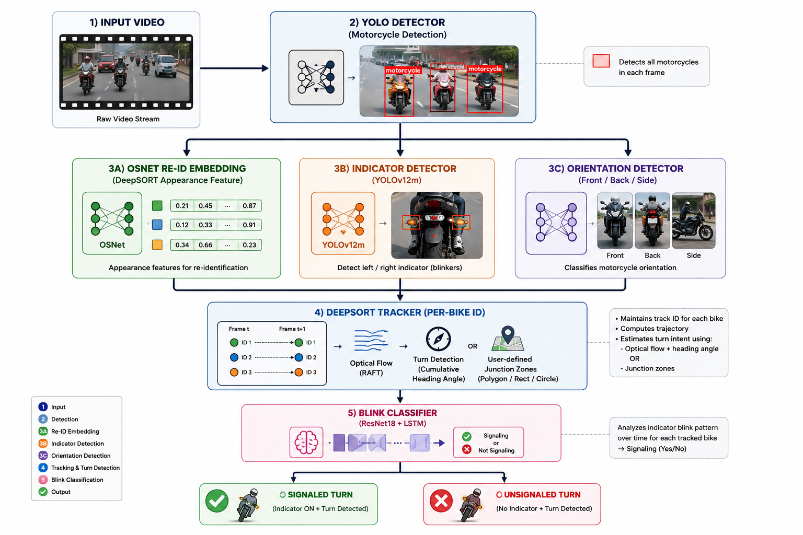

<div align="center">

# 🏍️ SafeRide Vision

### AI-Powered Motorcycle Turn-Signal Compliance Detection

*Real-time detection of motorcycles that turn **without** signaling — built on a custom multi-model computer vision pipeline.*

[](https://www.python.org/)
[](https://pytorch.org/)
[](https://ultralytics.com/)
[](https://github.com/nwojke/deep_sort)
[](https://flask.palletsprojects.com/)
[](#license)

</div>

---

## 📌 Overview

**SafeRide Vision** is an end-to-end pipeline that watches road footage, tracks every motorcycle across frames, and flags riders who **turn without signaling**. It fuses five custom-trained models — detection, re-identification, orientation, indicator, and blink classification — into a single DeepSORT-based tracker, then exposes the whole thing behind a Flask + ngrok API that a frontend can drop a video into and get an annotated result back.

> The core problem: standard trackers know *where* a vehicle is. This system also knows *what it's about to do* — and whether it warned anyone first.

---

## 🧠 The Pipeline

<p align="center">
  
</p>

---

## 🔬 Models & Datasets

Every component in this pipeline is a **custom-trained model**, not an off-the-shelf checkpoint.

<table>
<tr>
<th>Component</th>
<th>Architecture</th>
<th>Training Data</th>
<th>Result</th>
</tr>

<tr>
<td><b>🔦 Indicator & Mirror Detector</b></td>
<td>YOLOv12m</td>
<td>~7,000 labeled images<br/>~17,000 instances across <code>indicator</code> + <code>mirror</code> classes</td>
<td><b>75% mAP</b></td>
</tr>

<tr>
<td><b>👁️ Blink Detector</b></td>
<td>CNN + LSTM<br/>(ResNet18 backbone, sequence classifier)</td>
<td>1,000 labeled video clips (up to 3s each), every 2nd frame labeled — ~30–45 labeled frames/clip</td>
<td><b>95% accuracy</b></td>
</tr>

<tr>
<td><b>🧩 Re-Identification Embedder</b></td>
<td>OSNet (custom-trained, replaces mars-small128)</td>
<td>Large-scale motorcycle re-identification dataset</td>
<td>Drop-in DeepSORT feature encoder for bike-specific embeddings</td>
</tr>

<tr>
<td><b>🧭 Orientation Detector</b></td>
<td>YOLO-based classifier</td>
<td>3,000 labeled images across 3 orientation classes: <code>front</code>, <code>back</code>, <code>side</code></td>
<td>Feeds directly into the turn-detection logic</td>
</tr>

</table>

---

## 🔀 Two Ways to Detect a Turn

The system supports **two independent turn-detection strategies**, selectable per video:

### 1️⃣ Automatic — Orientation + Trajectory
The orientation model and cumulative-heading trajectory analysis work together to infer when a bike is turning, with no manual setup required. Good for general-purpose footage from any camera angle.

### 2️⃣ Manual — Junction Zone Marking
For a fixed camera on a known junction, the frontend lets you draw the exact spot where turns happen — as a **polygon, rectangle, or circle**, with support for **single or multiple shapes** at once. Draw it once (under 30 seconds), and turn detection becomes a simple zone-overlap check.

> 📈 **Result:** near-**100% turn detection accuracy** on fixed installations, since the geometry of the junction is known rather than inferred.

Both modes run through the same OR logic in the pipeline — angle-based detection always runs, and zone-overlap detection layers on top of it when junction coordinates are provided.

---

## ⚙️ How It Works, Frame by Frame

1. **Detect** — YOLO locates every motorcycle in the frame.
2. **Track** — DeepSORT assigns and maintains a stable ID per bike using OSNet embeddings + NMS-filtered detections.
3. **Understand** — Per tracked bike, the pipeline runs:
   - Mirror & indicator detection (position + slot tracking, so left/right indicators never swap identity)
   - Orientation classification (front / back / side)
   - RAFT optical flow for motion statistics
   - Cumulative heading-angle analysis for turn detection
4. **Verify the signal** — Once a bike is flagged as turning, its indicator crop history is fed into the blink classifier to confirm whether it's actually signaling.
5. **Annotate & log** — Every frame is drawn with color-coded boxes (🟢 signaled turn, 🔴 unsignaled turn) and a full per-frame CSV log is written for later analysis.

---

## 🌐 Backend API

A lightweight Flask server (Colab + ngrok friendly) wraps the pipeline for frontend consumption:

```http
POST /process-video
Content-Type: multipart/form-data

video            → video file
mode             → "direct" | "junction"
fps              → float            (junction mode only)
junction_count   → int              (junction mode only)
junctions        → JSON array       (junction mode only)
```

**Response**

```json
{
  "output_video_url": "/outputs/processed_video.mp4",
  "logs": [
    { "frame_idx": 1, "track_id": 3, "cx": 512.4, "cy": 240.1, "is_turning_algo": true, "...": "..." }
  ]
}
```

| Route | Description |
|---|---|
| `POST /process-video` | Upload a video, run the full pipeline, get back the annotated video + logs |
| `GET /videos` | List all previously processed videos, sorted by upload time |
| `GET /outputs/<file>` | Serve a processed video statically |
| `GET /health` | Basic liveness check |

---

## 🛠️ Tech Stack

<div align="center">

| Layer | Tools |
|---|---|
| **Detection** | YOLOv12m, YOLOv10m (Ultralytics) |
| **Tracking** | DeepSORT (`nwojke/deep_sort`) |
| **Re-ID Embeddings** | OSNet (`torchreid`) — custom trained |
| **Optical Flow** | RAFT-Small (`torchvision`) |
| **Blink Classification** | ResNet18 + LSTM (PyTorch) |
| **Backend** | Flask, Flask-CORS, pyngrok |
| **Runtime** | Google Colab (GPU) |

</div>

---

## 📊 Per-Frame Logs

Every processed video produces a CSV log with one row per live track per frame:

```
frame_idx, track_id, cx, cy, orientation_side, orientation_frontback,
flow_dx, flow_dy, flow_magnitude, flow_angle, cum_angle_change,
is_turning_algo, human_verification
```

This makes the system's decisions fully auditable — every turn call can be traced back to the exact trajectory, flow, and orientation evidence that produced it.

---

## 🚀 Getting Started

```bash
# Clone
git clone https://github.com/<your-username>/saferide-vision.git
cd saferide-vision

# Install dependencies
pip install flask flask-cors pyngrok ultralytics torch torchvision torchreid opencv-python

# Place model weights (see /weights) and run the backend
python backend_server.py
```

The server prints a public ngrok URL — point your frontend's backend-URL field at it, and you're live.

---

## 🗺️ Roadmap

- [ ] Expand indicator dataset for edge cases (night, rain, occlusion)
- [ ] Multi-camera junction fusion
- [ ] On-device / edge deployment (Jetson-class hardware)
- [ ] Dashboard for reviewing flagged violations

---

## 📄 License

Released under the [MIT License](LICENSE).

<div align="center">

**Built with 🏍️, 🧠, and a lot of CUDA hours.**

</div>
